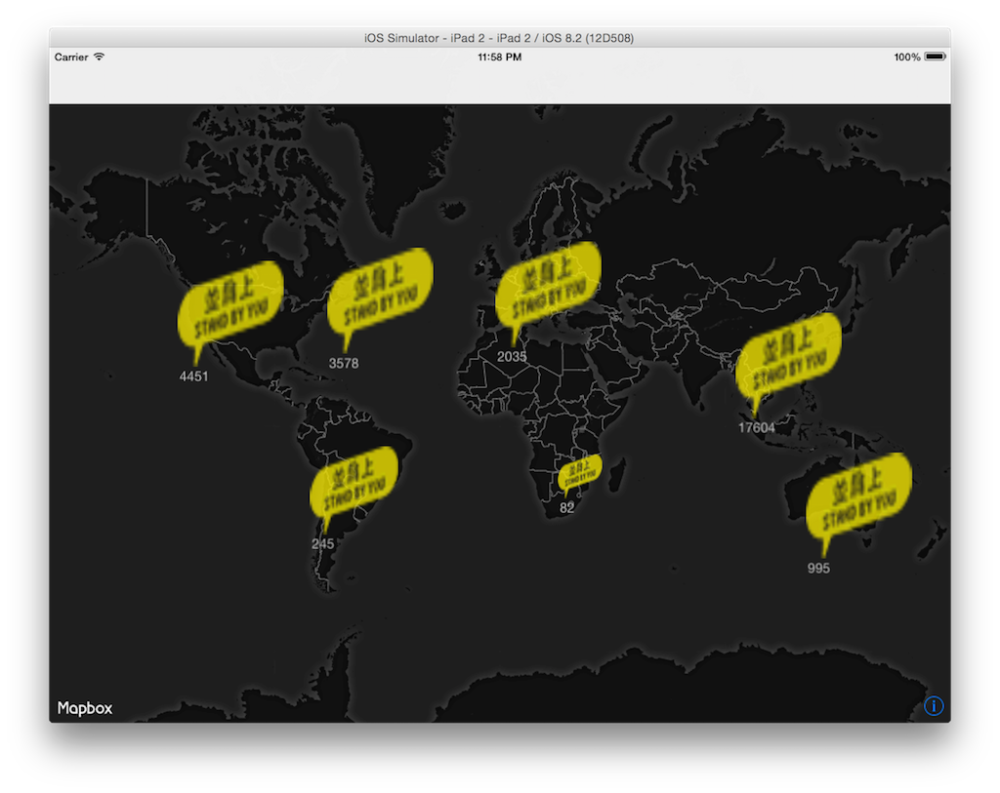

# AddOilMachineMap

## Getting Start
### install cocopod

```sudo gem install cocoapods```

### install dependencies

```cd <PROJECT_ROOT>```

```pod install ```

```open AddOilMachineMap.xcworkspace```



